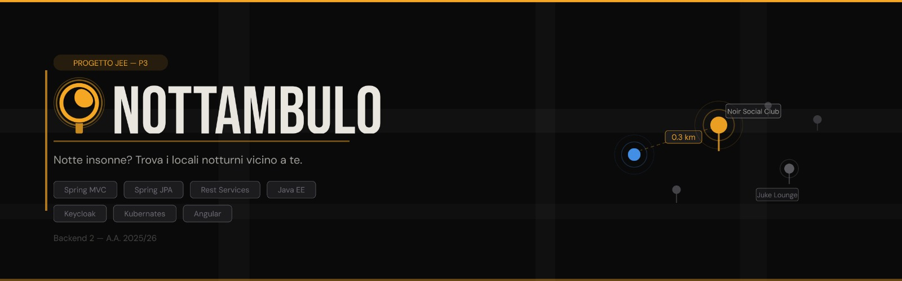

# app-nottambulo

Versione locale con:
- Frontend Angular
- Backend Spring Boot
- PostgreSQL
- Autenticazione JWT gestita dal backend

## Avvio locale

### Database PostgreSQL
```sql
CREATE DATABASE appdb;
```

Variabili utili:
- `SPRING_DATASOURCE_URL=jdbc:postgresql://localhost:5432/appdb`
- `SPRING_DATASOURCE_USERNAME=postgres`
- `SPRING_DATASOURCE_PASSWORD=postgres`
- `JWT_SECRET=ZGV2LXNlY3JldC1jaGFuZ2UtbWUtZGV2LXNlY3JldC1jaGFuZ2UtbWU=`
- `JWT_EXPIRATION_MS=86400000`

### Backend
```bash
cd backend
./mvnw spring-boot:run
```

### Frontend
```bash
cd frontend
npm install
npm start
```

Credenziali demo:
- username: `admin`
- password: `admin`

## Endpoint auth
- `POST /api/auth/login` restituisce `{ token, username, role }`
- usare `Authorization: Bearer <token>` per endpoint protetti `/api/admin/**`
- endpoint pubblici: `/api/locali/**`, `/api/auth/login`, `/actuator/health`

## Nota sulle modalità avanzate
File Kubernetes, ArgoCD, Docker e script infrastrutturali restano nel repository come modalità avanzata/opzionale, ma **non** sono richiesti per l’avvio principale.
